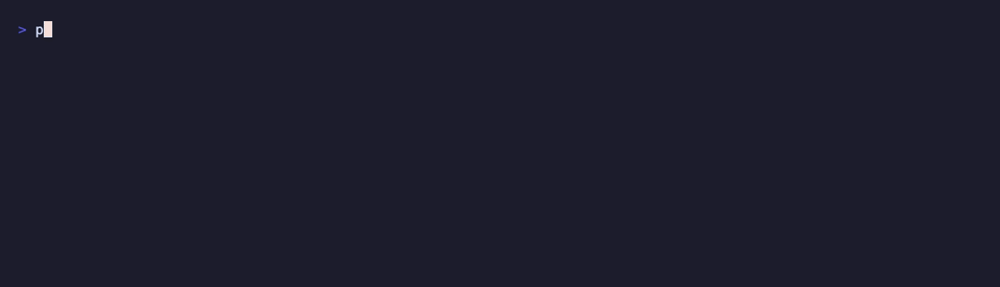

# microagent

[](https://github.com/rahul1368/microagent/actions/workflows/ci.yml)
[](https://www.python.org/)
[](LICENSE)

**The micrograd of AI agents.** A tiny, from-scratch agent framework with no dependencies. Small enough to read in one sitting and really understand.

Five building blocks. About 200 lines of core code. Zero runtime dependencies.



> This is not a production framework. For production, use [LangGraph](https://github.com/langchain-ai/langgraph) or the [OpenAI Agents SDK](https://github.com/openai/openai-agents-python). microagent is here to teach the ideas that sit underneath those tools, the same way [micrograd](https://github.com/karpathy/micrograd) teaches the idea underneath PyTorch without trying to replace it.

---

## The whole framework in one table

Every agent framework ends up rediscovering the same few ideas. microagent keeps only the smallest set you can build everything else from.

| Building block | What it is | PyTorch parallel |
|-----------|-----------|-----------------|
| **`Message`** | one piece of information (a user turn, a decision, a tool call, a result) | the scalar |
| **`Context`** | a growing list of messages that never gets edited, only added to | the Tensor |
| **`Tool`** | a function the agent can call to look something up or do something | a basic operation |
| **`Policy`** | the brain that picks the next action. Can be a rule, an LLM, or a net you trained | the part you can swap out |
| **`Agent`** | a Policy plus Tools plus a loop. An Agent can also be used as a Tool, so agents nest | `nn.Module` |

And one action, the loop, which is just this:

```
decide (Policy)  ->  act (Tool)  ->  add the result to Context  ->  repeat
```

Here is the whole office in one picture. The Agent keeps looping until the job
is done. The brain picks a worker, the worker hands back a result, and the
result goes into the notebook that everyone reads from.

```
                  +--------------------------------------------------+
                  |                     AGENT                        |
                  |          loops until the job is done             |
                  |                                                  |
   you ask  --->  |    +---------+   picks     +----------+          |  --->  answer
                  |    | POLICY  | ----------> |   TOOL   |          |
                  |    | (brain) |  an action  | (worker) |          |
                  |    +----^----+             +-----+----+          |
                  |         |     result written to     |            |
                  |         +------- CONTEXT <-----------+            |
                  |             the notebook you never erase,        |
                  |             made of MESSAGES                     |
                  +--------------------------------------------------+
```

## New here? Build it yourself first

The fastest way to understand this is to build it from nothing. Open
[`notebooks/build_microagent_from_scratch.py`](notebooks/build_microagent_from_scratch.py).
It rebuilds all five pieces one at a time, using the picture of a small office
(notes, a notebook, coworkers, a brain, and an assistant who keeps working), and
runs at every step. After that, [`docs/reading-order.md`](docs/reading-order.md)
walks you through the source in the right order.

## Install

```bash
git clone https://github.com/rahul1368/microagent
cd microagent
pip install -e ".[dev]"
```

## A 30-second taste

```python
from microagent import Agent, Action, Context, FunctionPolicy, final_answer_tool, tool


@tool(description="Multiply two integers a and b.")
def multiply(a: int, b: int) -> int:
    return a * b


def brain(ctx: Context, tools):
    last = ctx.last()
    if last and last.name == "multiply":
        return Action("final_answer", {"answer": f"= {last.content}"})
    return Action("multiply", {"a": 6, "b": 7})


agent = Agent(FunctionPolicy(brain), tools=[multiply, final_answer_tool()])
print(agent.answer("6 times 7?"))  # -> "= 42"
```

The brain above is plain Python, so it runs with no LLM and no network. To give it a real brain, you swap in one object. See [`examples/05_llm_agent.py`](examples/05_llm_agent.py):

```python
from microagent.adapters.ollama import OllamaPolicy

agent = Agent(OllamaPolicy(model="llama3.1"), tools=[multiply, final_answer_tool()])
```

Nothing else changes. The tools, the loop, and the Context stay the same. Swap the brain, keep the body. That is the main idea of the whole project.

## Examples

Run them from the repo root. Examples 01 to 04 work fully offline.

```bash
python examples/01_hello_agent.py     # the smallest possible loop
python examples/02_tool_use.py        # call a tool, read the result, then answer
python examples/03_multi_agent.py     # one agent used as a tool inside another
python examples/04_approval_gate.py   # ask a human before doing risky things
python examples/05_llm_agent.py       # same agent, real LLM brain (needs Ollama)
```

## Why these five building blocks

Because you can build everything from them. That is the real test of a good building block. (Can you build a CNN, an RNN, and a Transformer from just Tensor, autograd, and Module? Yes.) Here, all of these are the same five pieces put together in different ways:

- A **chatbot** is an Agent with one `respond` tool.
- A **tool-using agent** is an Agent plus tools plus an LLM brain.
- **RAG** is just a `retrieve` tool. No new building block.
- **Multi-agent** is an Agent whose tools are other Agents (`Agent.as_tool`).
- **Human approval** is a Tool that wraps another Tool (`with_approval`). No new building block.
- **Memory** is part of Context, or a `memory.read` and `memory.write` tool.

None of these needed a sixth building block. See [`DESIGN.md`](DESIGN.md) for the full reasoning, how this compares to existing frameworks, and the questions still left open.

## What this project does not try to do

- It does not compete with production frameworks. Those building blocks are already settled, and this repo says so plainly.
- The core stays tiny. It does not build in streaming, async, saved state, retries, or evaluation. Instead, [`notes/`](notes/) shows the smallest way each of those plugs on top, taught as chapters, not shipped as features.
- The point is simple. Read every line, understand every part, then go build the real thing knowing what is underneath it.

## License

[MIT](LICENSE)
